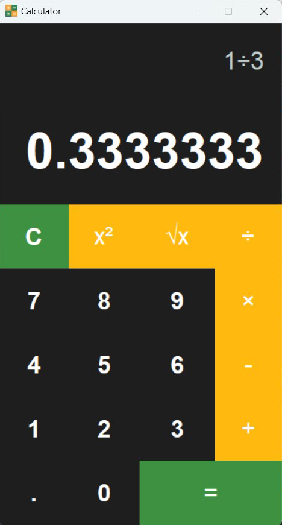

# Calculator App

A graphical user interface (GUI) calculator built using Python's Tkinter library. This calculator can perform basic arithmetic operations and provides an easy-to-use interface similar to standard calculators.



## Table of Contents

- [Features](#features)
- [Usage](#usage)
- [Project Structure](#project-structure)
- [Contact](#contact)

## Features

- **Basic Arithmetic Operations**: Addition, subtraction, multiplication, and division.
- **Square and Square Root**: Easily square a number or find its square root.
- **Clear Functionality**: Clear the display to start a new calculation.
- **Responsive Design**: Adjusts the layout for different screen sizes.
- **Keyboard Bindings**: Use keyboard keys for faster input.

## Usage

1. Launch the calculator by running the `Calculator.py` script.
2. Use the buttons or your keyboard to input numbers and operators.
3. Press `=` to get the result.
4. Use `C` to clear the current calculation.

### Keyboard Shortcuts:

- **Numbers and Decimal**: Press corresponding number keys (e.g., `0-9`, `.`).
- **Operations**: 
  - `+` for Addition
  - `-` for Subtraction
  - `*` for Multiplication
  - `/` for Division
- **Clear**: `C` or `Delete`
- **Square**: `Shift + S`
- **Square Root**: `Ctrl + R`
- **Calculate/Equals**: `Enter`

## Project Structure

```
calculator-app/
│
├── calculator.py # Main Python script for the calculator
├── README.md # Readme file for the project
└── assets/
    └── screenshot.png # Screenshot of the calculator UI
```

## Contact

**Vishnu VS**  
Email: vishnuvs.dev@gmail.com  
GitHub: [VSVishnu01](https://github.com/VSVishnu01)
